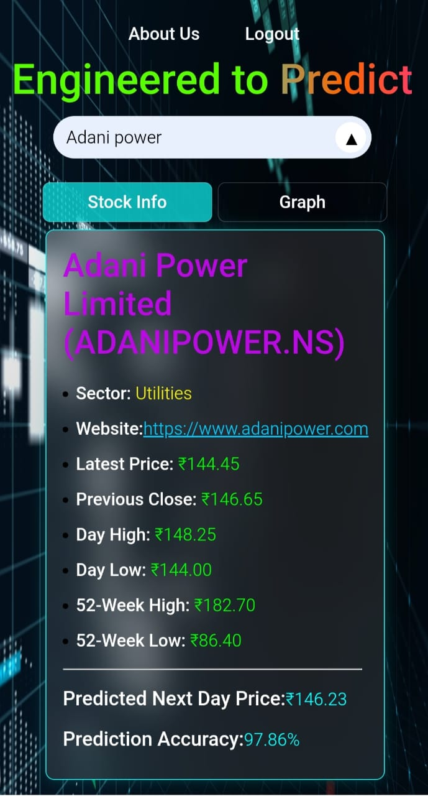
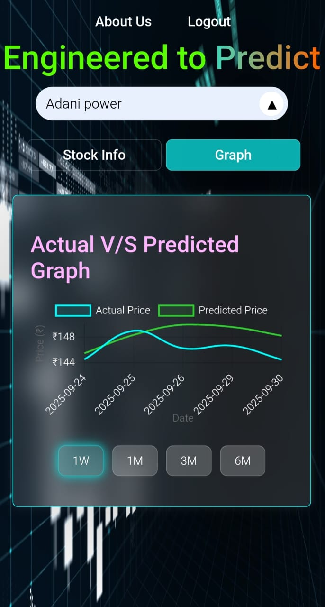

# NSE Stock Predictor 📈 (GPU Accelerated)

<p align="center">
  <b>  An intelligent stock forecasting tool that predicts the next day's closing price for companies listed on India's National   Stock Exchange (NSE). This application uses a Long Short-Term Memory (LSTM) model, enriched with various technical indicators, to provide data-driven insights for traders and investors.
  </b>
</p>

<p align="center">
  
  
  
  
  
  
  
</p>

---

## 🚀 Application Showcase

<p align="center">
  
  
  
</p>
<p align="center">
  
  
</p>
<p align="center">
  
  
</p>

---

## 📋 Table of Contents
- [About The Project](#about-the-project)
- [Key Features](#-key-features)
- [System Architecture](#-system-architecture)
- [Tech Stack](#-tech-stack)
- [Local Development Setup](#-local-development-setup)
- [Deployment](#-deployment)

## About The Project

The NSE Stock Predictor is an advanced forecasting tool designed to provide data-driven insights for traders and investors in the Indian stock market. It utilizes a sophisticated Long Short-Term Memory (LSTM) neural network, a class of Recurrent Neural Networks (RNNs) well-suited for time-series forecasting.

This project stands out due to its robust, scalable, and high-performance architecture. It is not a monolithic application; instead, it employs a **decoupled microservice architecture** where the frontend, user authentication, and the core machine learning model operate as independent services. The prediction engine is designed to run on a **GPU-accelerated environment** (like Google Colab), drastically reducing the prediction time from minutes to under 20 seconds.

## ✨ Key Features

- **High-Speed Predictions**: Leverages **Google Colab's T4 GPU** to accelerate TensorFlow model training, delivering predictions in seconds.
- **Microservice Architecture**: A decoupled backend with two independent servers for **Authentication** and **Prediction**, ensuring high availability and scalability.
- **Secure User Authentication**: Robust Signup/Login system with password hashing (`bcrypt`) and a dedicated **MongoDB** database for user data management.
- **Modern React Frontend**: A dynamic and responsive Single Page Application (SPA) built with **React and Vite**, providing a seamless user experience.
- **Rich Feature Engineering**: Incorporates key technical indicators to improve model accuracy:
  - Simple Moving Average (SMA)
  - Exponential Moving Average (EMA)
  - Relative Strength Index (RSI)
  - Moving Average Convergence Divergence (MACD)
  - On-Balance Volume (OBV)
  - Bollinger Band Width
- **Interactive Data Visualization**: Employs **Chart.js** to render interactive, client-side charts, allowing users to analyze actual vs. predicted prices across various time frames.
- **Fully Responsive UI**: A mobile-first design that offers a consistent and intuitive experience on both desktop and mobile devices, featuring a custom panel-toggle view for smaller screens.
- **Professional Onboarding Flow**: Includes a user onboarding process with a one-time "Terms & Conditions" acceptance for new users after their first login.

## 🏛️ System Architecture

The application is built on a distributed microservice model to ensure separation of concerns and independent scalability.


                +-----------------------------------------+
                |                                         |
                |             React Frontend              |
                |       (UI Hosted on Render.com)         |
                |                                         |
                +-------------------+---------------------+
                                    |
                                    | (HTTPS API Calls)
                     +--------------+--------------+
                     |                             |
                     v                             v
          +-------------------------+      +---------------------------+
          |                         |      |                           |
          |  Server 1: Auth Service |      | Server 2: Predict Service |
          |   (Flask + MongoDB)     |      |(Flask + TensorFlow + GPU) |
          |                         |      |                           |
          | Hosted on: Google Colab |      |  Hosted on: Google Colab  |
          |  Exposed via: Ngrok     |      |  Exposed via: Ngrok       |
          |                         |      |                           |
          +-------------------------+      +---------------------------+

---

## ✨ Features

- **High-Speed Predictions**: Leverages **Google Colab's T4 GPU** to accelerate TensorFlow model training, delivering predictions in seconds.
- **Microservice Architecture**: A decoupled backend with two independent servers for **Authentication** and **Prediction**, ensuring high availability and scalability.
- **Secure User Authentication**: Robust Signup/Login system with password hashing (`bcrypt`) and a dedicated **MongoDB** database for user data management.
- **Modern React Frontend**: A dynamic and responsive Single Page Application (SPA) built with **React and Vite**, providing a seamless user experience.
- **Interactive Data Visualization**: Employs **Chart.js** to render interactive, client-side charts, allowing users to analyze actual vs. predicted prices across various time frames.
- **Fully Responsive UI**: A mobile-first design that offers a consistent and intuitive experience on both desktop and mobile devices, featuring a custom panel-toggle view for smaller screens.
- **Professional Onboarding Flow**: Includes a user onboarding process with a one-time "Terms & Conditions" acceptance for new users after their first login.

---

## 🛠️ Tech Stack

A comprehensive list of the technologies, frameworks, and libraries used in this project.

| Category              | Technology / Library                                       |
| --------------------- | ---------------------------------------------------------- |
| **Frontend**          | `React.js`, `Vite`, `CSS3`, `Chart.js`                     |
| **Backend**           | `Python 3`, `Flask`, `Pyngrok`                             |
| **Machine Learning**  | `TensorFlow (Keras)`, `Scikit-learn`, `Pandas`, `NumPy`    |
| **Database**          | `MongoDB Atlas`, `PyMongo`                                 |
| **Authentication**    | `Passlib`, `Bcrypt`                                        |
| **Deployment**        | `Render.com` (Frontend), `Google Colab` (Backend Servers)     |

---

## 🚀 Getting Started

To run this project, you need to set up and run the two backend servers and the frontend client separately.

### Prerequisites
- Python 3.8+ (`pip`, `venv`)
- Node.js v18+ and `npm`
- A MongoDB Atlas account and connection string.
- An Ngrok account and Auth Token.

### Installation & Setup

1.  **Clone the Repository**
    ```sh
    git clone [https://github.com/your-username/your-repo-name.git](https://github.com/your-username/your-repo-name.git)
    cd your-repo-name
    ```

2.  **Setup Backend Server 1 (Authentication)**
    - Navigate to the `server1` directory: `cd server1`
    - Create and activate a virtual environment.
    - Install dependencies: `pip install -r requirements.txt`
    - **Create a `config.py` file** inside the `server1` folder and add your secret keys:
      ```python
      # server1/config.py
      NGROK_AUTH_TOKEN = "YOUR_NGROK_AUTH_TOKEN"
      NGROK_STATIC_DOMAIN_AUTH = "your-auth-domain.ngrok-free.app"
      MONGO_URI = "YOUR_MONGO_CONNECTION_STRING"
      DB_NAME = "stock_predictor_users"
      ```
    - Run the server: `python auth_app.py`
    - *Note the public URL for the Auth Server.*

3.  **Setup Backend Server 2 (Prediction)**
    - Navigate to the `server2` directory: `cd ../server2`
    - Create and activate a virtual environment.
    - Install dependencies: `pip install -r requirements.txt`
    - **Create a `config.py` file** inside the `server2` folder and add your secret keys:
      ```python
      # server2/config.py
      NGROK_AUTH_TOKEN = "YOUR_NGROK_AUTH_TOKEN"
      NGROK_STATIC_DOMAIN_PREDICT = "your-predict-domain.ngrok-free.app"
      ```
    - Run the server (preferably on a GPU environment like Colab): `python predict_app.py`
    - *Note the public URL for the Prediction Server.*

4.  **Setup Frontend**
    - Navigate to the `frontend` directory: `cd ../frontend`
    - Install dependencies: `npm install`
    - **Configure Frontend URLs** by opening `frontend/src/config.js` and pasting the public Ngrok URLs from `server1` and `server2`.

5.  **Run the Frontend**
    ```sh
    npm start
    ```
    - The application will be available at `http://localhost:5173`.

---

## 🌐 Deployment

- The **Frontend** is designed for seamless deployment on static hosting platforms like **Render.com** or **Vercel**.
- The **Backend Servers** are configured to run on **Google Colab**, leveraging its free T4 GPU resources for high-speed computation. **Ngrok** is used to create secure public tunnels to the Colab instances.

---

## 📂 Project Structure


          NSE_STOCK_PREDICTOR/
          ├── 📁 assets/
          │   ├── 🖼️ Screenshot 2025-0...png
          │   ├── 🖼️ Screenshot 2025-0...png
          │   ├── 🖼️ Screenshot 2025-0...png
          │   ├── 🖼️ Screenshot 2025-0...png
          │   ├── 🖼️ Screenshot 2025-0...png
          │   ├── 🖼️ Screenshot 2025-0...png
          │   └── 🖼️ Screenshot 2025-0...png
          │
          ├── 📁 frontend/
          │   ├── 📁 node_modules/     (Ignored by git)
          │   ├── 📁 public/
          │   │   ├── 🖼️ bgvideo.mp4
          │   │   ├── 🖼️ favicon.png
          │   │   └── 🖼️ vite.svg
          │   ├── 📁 src/
          │   │   ├── 📁 assets/
          │   │   │   └── 🖼️ react.svg
          │   │   ├── 📁 components/
          │   │   │   ├── 📄 About.jsx
          │   │   │   ├── 📄 Auth.css
          │   │   │   ├── 📄 LoginPage.jsx
          │   │   │   ├── 📄 LoginPopup.css
          │   │   │   ├── 📄 LoginPopup.jsx
          │   │   │   ├── 📄 PanelToggle.jsx
          │   │   │   ├── 📄 SearchBar.jsx
          │   │   │   ├── 📄 SignupPage.jsx
          │   │   │   ├── 📄 StockChart.jsx
          │   │   │   ├── 📄 StockInfo.jsx
          │   │   │   ├── 📄 TermsPage.css
          │   │   │   └── 📄 TermsPage.jsx
          │   │   ├── 📄 App.css
          │   │   ├── 📄 App.jsx
          │   │   ├── 📄 config.js
          │   │   ├── 📄 index.css
          │   │   ├── 📄 main.jsx
          │   │   ├── 📄 style1.css
          │   │   └── 📄 style2.css
          │   ├── 📄 .gitignore
          │   ├── 📄 index.html
          │   ├── 📄 package-lock.json
          │   ├── 📄 package.json
          │   ├── 📄 README.md
          │   └── 📄 vite.config.js
          │
          ├── 📁 server1/
          │   ├── 🐍 auth_app.py
          │   ├── 🐍 config.py
          │   └── 📄 requirements.txt
          │
          ├── 📁 server2/
          │   ├── 📁 __pycache__/      (Ignored by git)
          │   ├── 🐍 config.py
          │   ├── 📄 EQUITY_L.csv
          │   ├── 🐍 ml_model.py
          │   ├── 🐍 predict_app.py
          │   └── 📄 requirements.txt
          │
          ├── 📄 .gitignore            (Root gitignore for the whole project)
          └── 📄 readme.md